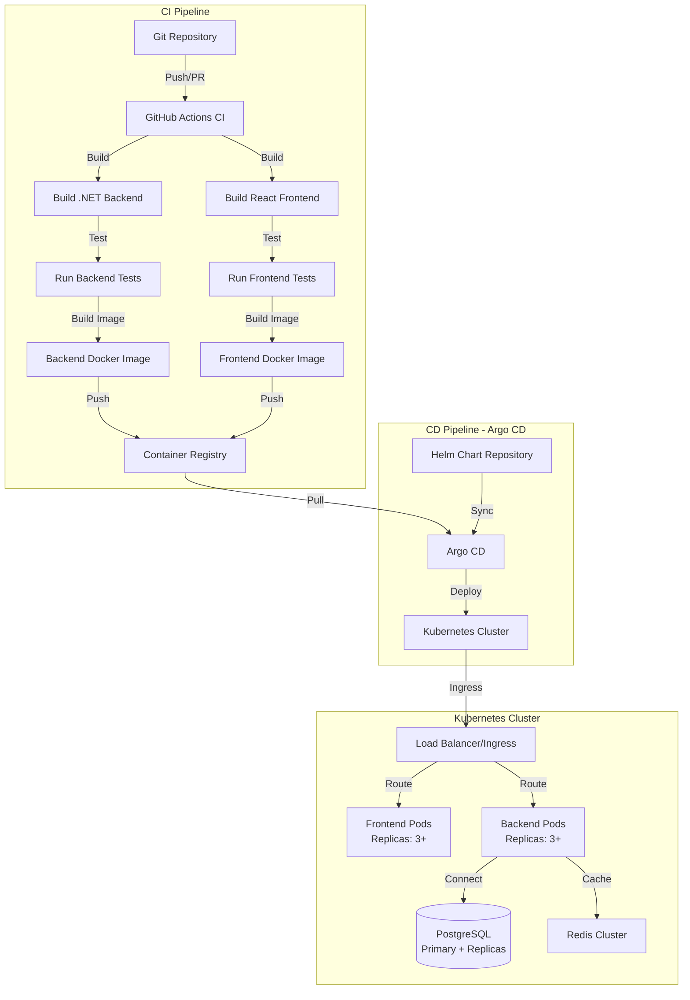

# CI/CD Strategy for Ezra Todo Application

## Overview

This document outlines a comprehensive CI/CD strategy for the Ezra Todo application, covering containerization, horizontal scaling, load balancing, and GitOps deployment with Argo CD. While CI/CD is currently out of scope for the MVP, this document demonstrates production deployment considerations and architectural thinking.

## Architecture Overview



## 1. Containerization Strategy

### 1.1 Backend Containerization

**Dockerfile Location**: `backend/TodoApi/Dockerfile`

**Multi-stage Build Approach**:
- **Stage 1 (Build)**: Use `mcr.microsoft.com/dotnet/sdk:10.0` to restore dependencies and build the application
- **Stage 2 (Runtime)**: Use `mcr.microsoft.com/dotnet/aspnet:10.0` for a minimal runtime image

**Key Considerations**:
- Use `.dockerignore` to exclude `bin/`, `obj/`, `node_modules/`, and database files
- Set `ASPNETCORE_ENVIRONMENT=Production` in production builds
- Configure health check endpoint (`/health` or `/healthz`)
- Use non-root user for security
- Expose port 8080 (standard for Kubernetes)

**Environment Variables**:
- Database connection strings (from Kubernetes secrets)
- JWT secret keys (from Kubernetes secrets)
- CORS origins (configured for production frontend domain)

### 1.2 Frontend Containerization

**Dockerfile Location**: `frontend/Dockerfile`

**Multi-stage Build Approach**:
- **Stage 1 (Build)**: Use `node:20-alpine` to install dependencies and run `npm run build`
- **Stage 2 (Runtime)**: Use `nginx:alpine` to serve static files

**Key Considerations**:
- Build React app with production optimizations
- Serve static files via nginx for performance
- Configure nginx to handle React Router (SPA routing)
- Set appropriate cache headers for static assets
- Use nginx reverse proxy configuration for API calls (or configure CORS properly)

**Build-time Variables**:
- `VITE_API_BASE_URL` - Backend API URL (injected at build time)

## 2. CI Pipeline (Continuous Integration)

### 2.1 GitHub Actions Workflow

**Location**: `.github/workflows/ci-cd.yml`

**Pipeline Stages**:

1. **Lint & Format Check**
   - Backend: `dotnet format --verify-no-changes`
   - Frontend: `npm run lint`

2. **Build**
   - Backend: `dotnet build --configuration Release`
   - Frontend: `npm ci && npm run build`

3. **Test**
   - Backend: `dotnet test` (runs `TodoApi.Tests`)
   - Frontend: `npm test` (when tests are added)

4. **Security Scanning**
   - Backend: `dotnet list package --vulnerable`
   - Frontend: `npm audit`
   - Container: Trivy scan on Docker images

5. **Build Docker Images**
   - Build backend image with tag: `{commit-sha}` and `latest` (on main branch)
   - Build frontend image with tag: `{commit-sha}` and `latest` (on main branch)

6. **Push to Container Registry**
   - Push to Docker Hub, GitHub Container Registry, or private registry
   - Tag images appropriately for different environments (dev, staging, prod)

### 2.2 Branch Strategy

- **Feature branches**: Build and test only (no deployment)
- **Develop branch**: Deploy to development environment
- **Main branch**: Deploy to staging, then production (with approval gates)

## 3. CD Pipeline - Argo CD (GitOps)

### 3.1 GitOps Philosophy

- **Source of Truth**: Git repository contains all deployment manifests
- **Declarative**: Desired state defined in Helm charts
- **Automated**: Argo CD continuously syncs Git state to Kubernetes
- **Auditable**: All changes tracked in Git history

### 3.2 Helm Chart Structure

**Location**: `k8s/helm/ezra-todo/`

```
k8s/helm/ezra-todo/
├── Chart.yaml              # Chart metadata
├── values.yaml             # Default values
├── values-dev.yaml         # Development overrides
├── values-staging.yaml     # Staging overrides
├── values-prod.yaml        # Production overrides
├── templates/
│   ├── deployment.yaml     # Backend & Frontend deployments
│   ├── service.yaml        # Kubernetes services
│   ├── ingress.yaml        # Ingress configuration
│   ├── configmap.yaml      # Non-sensitive config
│   ├── secret.yaml         # Sensitive data (encrypted with Sealed Secrets)
│   ├── hpa.yaml            # Horizontal Pod Autoscaler
│   ├── pdb.yaml            # Pod Disruption Budget
│   └── _helpers.tpl        # Template helpers
└── charts/                 # Sub-charts (if needed)
```

### 3.3 Helm Chart Components

**Backend Deployment**:
- Replicas: Configurable (default: 3 for production)
- Resource limits: CPU (500m-2), Memory (512Mi-2Gi)
- Health checks: Liveness and readiness probes
- Environment variables from ConfigMap and Secrets
- Volume mounts for configuration (if needed)

**Frontend Deployment**:
- Replicas: Configurable (default: 3 for production)
- Resource limits: CPU (100m-500m), Memory (128Mi-512Mi)
- Health checks: HTTP GET on `/`

**Services**:
- Backend: ClusterIP service on port 8080
- Frontend: ClusterIP service on port 80

**Ingress**:
- Configure TLS/SSL certificates (Let's Encrypt via cert-manager)
- Path-based routing:
  - `/api/*` → Backend service
  - `/*` → Frontend service
- Rate limiting annotations
- CORS handled at application level

### 3.4 Argo CD Application Configuration

**Location**: `k8s/argocd/applications/`

**Application Structure**:
- **Application**: `ezra-todo-prod`
  - Source: Helm chart repository or Git path
  - Destination: Production Kubernetes cluster
  - Sync Policy: Automated (with sync windows)
  - Auto-prune: Enabled (removes resources not in Git)
  - Self-heal: Enabled (reverts manual changes)

**Sync Strategies**:
- **Automated Sync**: For non-critical updates
- **Manual Sync**: For production deployments (with approval)
- **Sync Windows**: Prevent deployments during business hours (optional)

## 4. Horizontal Scaling

### 4.1 Horizontal Pod Autoscaler (HPA)

**Backend HPA Configuration**:
- **Metrics**: CPU utilization (target: 70%), Memory utilization (target: 80%)
- **Min Replicas**: 3 (for high availability)
- **Max Replicas**: 10 (based on expected load)
- **Scale-down**: Conservative (5-minute stabilization window)
- **Scale-up**: Aggressive (immediate response to traffic spikes)

**Frontend HPA Configuration**:
- **Metrics**: CPU utilization (target: 70%)
- **Min Replicas**: 3
- **Max Replicas**: 5 (frontend is stateless, less resource-intensive)

### 4.2 Database Scaling

**PostgreSQL Configuration**:
- **Primary-Replica Setup**: 
  - 1 Primary (write operations)
  - 2+ Read Replicas (read operations, load balanced)
- **Connection Pooling**: PgBouncer or built-in EF Core connection pooling
- **Read/Write Splitting**: Configure EF Core to use read replicas for queries

**Migration from SQLite**:
- Use EF Core migrations for schema management
- Data migration script for existing SQLite data
- Zero-downtime migration strategy

### 4.3 Stateless Application Design

**Current State**: Application is already stateless (JWT tokens, no server-side sessions)

**Considerations for Scaling**:
- ✅ JWT tokens (stateless authentication)
- ✅ No in-memory session storage
- ✅ Database-backed state (shared across instances)
- ⚠️ File uploads (if added): Use object storage (S3, Azure Blob)
- ⚠️ Caching: Use Redis cluster (shared cache across instances)

## 5. Load Balancing

### 5.1 Kubernetes Service Load Balancing

**Service Type**: ClusterIP (internal) with Ingress for external access

**Load Balancing Strategy**:
- **Algorithm**: Round-robin (default) or least connections
- **Session Affinity**: None (stateless application)
- **Health Checks**: Kubernetes readiness probes determine traffic routing

### 5.2 Ingress Controller

**Options**:
- **NGINX Ingress Controller**: Most common, feature-rich
- **Traefik**: Simpler configuration, good for cloud-native
- **AWS ALB Ingress**: If using AWS EKS

**Configuration**:
- **TLS Termination**: At ingress level (cert-manager for Let's Encrypt)
- **Rate Limiting**: Configured at ingress level (requests per IP)
- **Path-based Routing**: `/api/*` to backend, `/*` to frontend
- **CORS**: Handled at application level (backend)

### 5.3 External Load Balancer

**Cloud Provider Options**:
- **AWS**: Application Load Balancer (ALB) or Network Load Balancer (NLB)
- **Azure**: Azure Load Balancer or Application Gateway
- **GCP**: Cloud Load Balancing

**Features**:
- SSL/TLS termination
- Health checks
- Geographic distribution (multi-region)
- DDoS protection

## 6. Environment Strategy

### 6.1 Environment Separation

- **Development**: Single replica, minimal resources, SQLite (or dev PostgreSQL)
- **Staging**: 2 replicas, production-like resources, PostgreSQL replica
- **Production**: 3+ replicas, full resources, PostgreSQL primary + replicas

### 6.2 Configuration Management

**Secrets Management**:
- **Sealed Secrets**: Encrypt secrets in Git (recommended for GitOps)
- **External Secrets Operator**: Sync from external secret stores (AWS Secrets Manager, HashiCorp Vault)
- **Kubernetes Secrets**: Base64 encoded (not encrypted at rest by default)

**ConfigMaps**:
- Non-sensitive configuration (appsettings.json equivalent)
- Environment-specific values (dev, staging, prod)
- Managed via Helm values files

## 7. Monitoring & Observability

### 7.1 Application Monitoring

- **Metrics**: Prometheus + Grafana
  - Application metrics (request rate, latency, error rate)
  - Business metrics (tasks created, users active)
- **Logging**: ELK Stack (Elasticsearch, Logstash, Kibana) or Loki
  - Centralized logging from all pods
  - Structured logging (JSON format)
- **Tracing**: Jaeger or Zipkin (for distributed tracing)

### 7.2 Infrastructure Monitoring

- **Kubernetes Metrics**: cAdvisor, kube-state-metrics
- **Node Metrics**: Node Exporter
- **Database Metrics**: PostgreSQL exporter

## 8. Disaster Recovery & High Availability

### 8.1 High Availability

- **Multi-AZ Deployment**: Deploy pods across availability zones
- **Pod Disruption Budgets**: Ensure minimum replicas during updates
- **Database**: PostgreSQL with automatic failover (Patroni, Stolon)
- **Backup Strategy**: Automated daily backups with point-in-time recovery

### 8.2 Rollback Strategy

- **Argo CD Rollback**: Revert to previous Git commit
- **Helm Rollback**: `helm rollback <release> <revision>`
- **Database Migrations**: Versioned migrations with rollback scripts

## 9. Security Considerations

### 9.1 Container Security

- **Image Scanning**: Trivy, Snyk, or Clair
- **Non-root User**: Run containers as non-root
- **Read-only Root Filesystem**: Where possible
- **Minimal Base Images**: Alpine Linux or distroless images

### 9.2 Kubernetes Security

- **Network Policies**: Restrict pod-to-pod communication
- **RBAC**: Least privilege access for service accounts
- **Pod Security Standards**: Enforce security contexts
- **Secrets Management**: Encrypted secrets, rotation policies

## 10. Cost Optimization

### 10.1 Resource Optimization

- **Right-sizing**: Start with minimal resources, scale based on metrics
- **Spot Instances**: Use for non-critical workloads (development/staging)
- **Autoscaling**: Scale down during low-traffic periods
- **Reserved Instances**: For predictable production workloads

### 10.2 Database Optimization

- **Connection Pooling**: Reduce database connections
- **Read Replicas**: Offload read traffic from primary
- **Query Optimization**: Monitor slow queries, add indexes

## 11. Implementation Roadmap

### Phase 1: Foundation (Week 1-2)
1. Create Dockerfiles for backend and frontend
2. Set up GitHub Actions CI pipeline
3. Push images to container registry
4. Basic Kubernetes manifests (without Helm)

### Phase 2: Helm & Argo CD (Week 3-4)
1. Create Helm chart structure
2. Configure Argo CD application
3. Set up development environment deployment
4. Test GitOps workflow

### Phase 3: Production Readiness (Week 5-6)
1. Configure HPA for autoscaling
2. Set up monitoring and logging
3. Implement secrets management
4. Configure production ingress and TLS
5. Database migration from SQLite to PostgreSQL

### Phase 4: Optimization (Week 7+)
1. Fine-tune autoscaling parameters
2. Optimize resource requests/limits
3. Implement advanced monitoring
4. Set up disaster recovery procedures

## 12. Example Files Structure

```
Ezra/
├── backend/
│   └── TodoApi/
│       └── Dockerfile
├── frontend/
│   └── Dockerfile
├── .github/
│   └── workflows/
│       └── ci-cd.yml
├── k8s/
│   ├── helm/
│   │   └── ezra-todo/
│   │       ├── Chart.yaml
│   │       ├── values.yaml
│   │       ├── values-dev.yaml
│   │       ├── values-prod.yaml
│   │       └── templates/
│   └── argocd/
│       └── applications/
│           ├── ezra-todo-dev.yaml
│           └── ezra-todo-prod.yaml
└── .dockerignore
```

## 13. Key Benefits of This Approach

1. **Scalability**: Horizontal scaling handles traffic spikes automatically
2. **Reliability**: Multi-replica deployment ensures high availability
3. **GitOps**: All infrastructure changes are version-controlled and auditable
4. **Automation**: CI/CD pipeline reduces manual deployment errors
5. **Consistency**: Same deployment process across all environments
6. **Rollback**: Quick rollback to previous versions if issues occur
7. **Cost Efficiency**: Autoscaling optimizes resource usage

## 14. Trade-offs & Considerations

### Advantages
- ✅ Production-ready deployment strategy
- ✅ Industry-standard tools (Kubernetes, Argo CD, Helm)
- ✅ Scalable and maintainable
- ✅ GitOps provides audit trail and consistency

### Challenges
- ⚠️ Initial setup complexity
- ⚠️ Learning curve for team members
- ⚠️ Infrastructure costs (Kubernetes cluster)
- ⚠️ Requires DevOps expertise

### Alternatives (Simpler)
- **Docker Compose**: For small-scale deployments
- **Cloud PaaS**: Heroku, Railway, Render (simpler but less control)
- **Serverless**: AWS Lambda, Azure Functions (for serverless architecture)

## 15. Knowledge Areas Demonstrated

This strategy document demonstrates understanding of:

1. **Containerization**: Multi-stage Docker builds, image optimization, security best practices
2. **Horizontal Scaling**: HPA configuration, stateless application design, database scaling strategies
3. **Load Balancing**: Kubernetes services, ingress controllers, external load balancers, health checks
4. **GitOps & Argo CD**: Declarative deployments, Helm charts, continuous sync, self-healing
5. **Kubernetes**: Deployments, services, ingress, ConfigMaps, Secrets, HPA, PDB
6. **CI/CD**: Automated testing, security scanning, image building, multi-environment deployments
7. **Production Considerations**: Monitoring, logging, security, disaster recovery, cost optimization

## Conclusion

This CI/CD strategy provides a comprehensive, production-ready approach to deploying the Ezra Todo application. While it's currently out of scope for the MVP, this document demonstrates:

1. **Containerization expertise**: Multi-stage Docker builds, optimization
2. **Horizontal scaling knowledge**: HPA, stateless design, database scaling
3. **Load balancing understanding**: Kubernetes services, ingress, external load balancers
4. **GitOps proficiency**: Argo CD, Helm charts, declarative deployments

The architecture is designed to scale from MVP to production, with clear migration paths and optimization strategies. The stateless design of the current application (JWT-based auth, no server-side sessions) makes it particularly well-suited for horizontal scaling and load balancing.

---

**Note**: This document is for demonstration purposes and shows architectural thinking about production deployment. Implementation would follow the roadmap outlined in Section 11 when CI/CD is prioritized.

